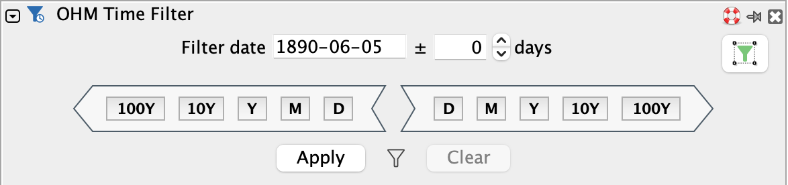
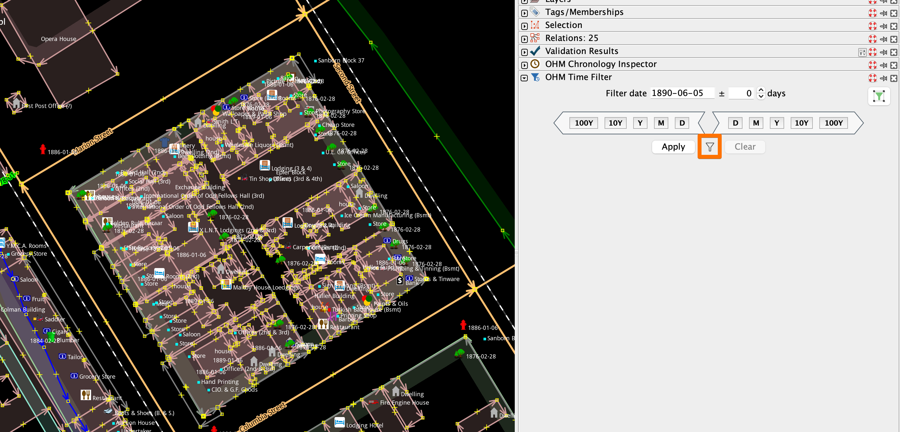
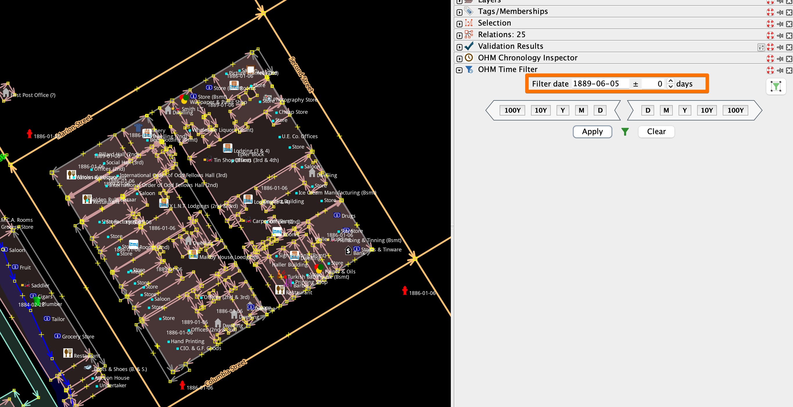
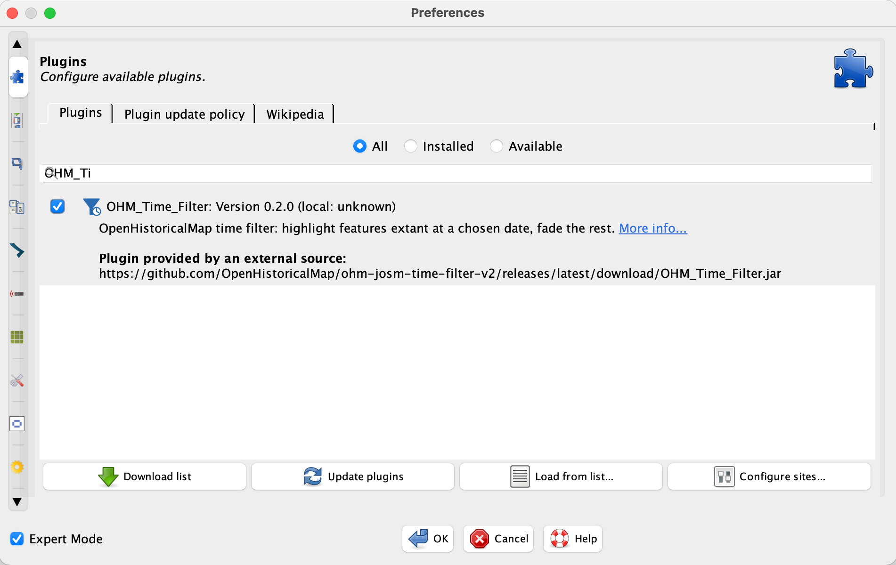

# OHM_Time_Filter — an OpenHistoricalMap time filter plugin for JOSM

A JOSM plugin for [OpenHistoricalMap](https://www.openhistoricalmap.org/)
that highlights features existing at a chosen date and fades or hides the rest.



This is kind of like a timeslider without, you know, the slider thing.

## What it does

Given a "filter date" and an optional ± window, the plugin classifies every object (node, way, 
or relation) in your data layer based on its `start_date` / `end_date` tags:

Objects that exist:
- **On this day** — are fully visible and selectable.
- **Inside the time window** — are visible but muted & still selectable.
- **Outside of the time window** — are hidden from view, but are still in the dataset, selection is cleared.

Two chevron-shaped groups of buttons — one pointing backward, one
pointing forward — let you scrub the filter date by century / decade /
year / month / day (`100Y`, `10Y`, `Y`, `M`, `D`), re-applying the
filter on each click. A separate "Filter to Selection" button picks a
focus date by averaging the selected primitives' dates and applies it.

The plugin composes with JOSM's built-in Filter dialog: the time filter only
ever *escalates* primitive visibility (an item already hidden by a JOSM tag
filter stays hidden), it never reveals.

Here's [a block in Seattle](https://www.openhistoricalmap.org/#map=17/47.603384/-122.333037&layers=O&date=1865-01-12&daterange=1000-01-01,2026-12-31) with data from multiple Sanborn maps and no filter applied:


Here's the same block set to the day before [the Great Seattle Fire](https://en.wikipedia.org/wiki/Great_Seattle_Fire).


Here's the same block 1 year later, set by pressing the Y> button.
 button" src="docs/filter-2.png" />

## Installation

### From JOSM settings/preferences Plugin panel (recommended)


### From release .jar

Pre-built jars are attached to each
[GitHub release](https://github.com/OpenHistoricalMap/ohm-josm-time-filter-v2/releases).
Grab the latest `OHM_Time_Filter.jar` from there if you don't want to
build from source.

Drop `OHM_Time_Filter.jar` (downloaded from a release, or built locally
per the instructions below) into your JOSM plugins directory:

- macOS: `~/Library/JOSM/plugins/`
- Linux: `~/.config/JOSM/plugins/` or `~/.local/share/JOSM/plugins/`
- Windows: `%APPDATA%\JOSM\plugins\`

Then enable the plugin in **Preferences → Plugins**.

### From source

#### Requirements:
- JOSM **r19439** or later.
- Java **17** or later.

#### Build: 
The plugin compiles directly against a JOSM core jar — no Ivy / Maven needed.

```sh
# 1. Check out JOSM trunk into core/ (gitignored).
svn checkout https://josm.openstreetmap.de/svn/trunk core

# 2. Build the jar.
ant dist
# → dist/OHM_Time_Filter.jar

# 3. (optional) Run unit tests.
ant test

# 4. (optional) Build, copy to your JOSM plugins dir, and launch JOSM.
ant runjosm
```

The build pins to the revision of `core/` you have checked out; bumping
`core/` requires bumping `plugin.main.version` in `build.xml`.

#### Project layout:

```
src/                    Plugin source (org.openhistoricalmap.josm.plugins.timefilter)
test/unit/              JUnit 4 unit tests (pure-data; no JOSM static init)
resources/images/       Plugin icons (svg)
build.xml               Self-contained Ant build
core/                   JOSM trunk svn checkout (gitignored)
lib/                    Test deps — junit / hamcrest (gitignored)
```

## Public API for other plugins

Since v0.3.0, other JOSM plugins can trigger the **Filter to Selection**
behavior without a compile-time dependency on `OHM_Time_Filter`. Use
reflection so the call is a silent no-op when the plugin isn't
installed:

```java
try {
    Class<?> tfp = Class.forName(
        "org.openhistoricalmap.josm.plugins.timefilter.TimeFilterPlugin");
    tfp.getMethod("filterToSelection").invoke(null);
} catch (ReflectiveOperationException ignored) {
    // OHM_Time_Filter not loaded — leave the user alone.
}
```

The static method:

- reads the current JOSM selection,
- derives a focus date (single primitive with one open endpoint → that
  endpoint; otherwise → arithmetic mean of every defined endpoint),
- applies the filter using the persisted ± window offset,
- surfaces user-facing failures (no active layer, no selection, no
  parseable dates, hidden-after-apply) via JOSM Notifications.

It's the same code path the dialog's **Filter to Selection** button
uses, so the two stay in lockstep.

## Contributing

Pull requests and issues welcome. Two one-time setup steps before your first
commit:

```sh
# Use the project's commit-message template (preloads the Co-Authored-By
# trailer when you run `git commit` interactively).
git config commit.template .gitmessage

# Activate the prepare-commit-msg hook so the trailer is appended even on
# `git commit -m "…"` invocations.
git config core.hooksPath .githooks
```

## AI-assisted development

This project was developed with substantial assistance from Anthropic's
Claude (web interface and Claude Code). See
[ATTRIBUTION.md](ATTRIBUTION.md) for the full disclosure and rationale.
Commits that involved AI assistance carry a `Co-Authored-By: Claude`
trailer; the hook above keeps that consistent across `git commit` and
`git commit -m`.

## License

GPL — see [LICENSE](LICENSE).
